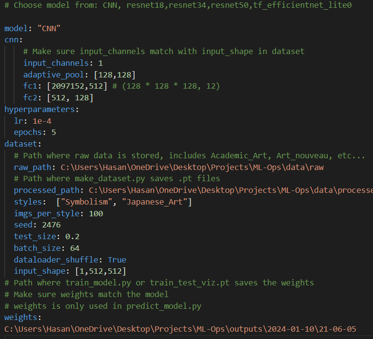
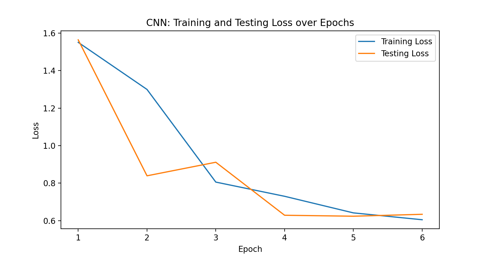

# ML-Art


# Motivation

This project represents an application of machine learning in the domain of visual arts, where we are hoping to see how technology can be used to interpret and analyze artistic works.

# Data Analysis


## Getting Started


1. Create your env
```
make create_environment
```

2. Activate env
```
conda activate ml_art
```

3. Install dependencies
```
make requirements
```
4. Configuration

Setup your desired experiment
* First, start with data; configure styles and img_per_style
* Second, choose a model. We have a custom CNN and models from [timm models](https://timm.fast.ai/) such as resnet and efficientnet



5. Process raw data into .pt files

+ This assumes you have the raw data from [dataset src](https://www.kaggle.com/datasets/sivarazadi/wikiart-art-movementsstyles) such that:
    + data/raw/Academic_Art/Academic_Art/*.jpg
    + data/raw/Art_Nouveau/Art_Nouveau/*.jpg
    + data/raw/Baroque/Baroque/*.jpg
    + etc

+ Make sure to add the **FULL PATH** to raw data in config file


+ Then:

```
make data
```
+ You should see something like this
```
[2024-01-10 21:50:10,436][__main__][INFO] - Processed raw data into a .pt file stored in C:\Users\Hasan\OneDrive\Desktop\Projects\ML-Ops\outputs\2024-01-10\21-50-10
```
6. Train the model

+ Make sure to add the **FULL PATH** to processed data in config file, this path is logged in terminal when you run make data. 


```
make train
```

+ You should see something like this
```
[2024-01-10 22:35:15,741][__main__][INFO] - Saved Weights to C:\Users\Hasan\OneDrive\Desktop\Projects\ML-Ops\outputs\2024-01-10\22-34-09
[2024-01-10 22:35:15,799][__main__][INFO] - Saved training loss & accuracy to C:\Users\Hasan\OneDrive\Desktop\Projects\ML-Ops\outputs\2024-01-10\22-34-09
```

7. To Viz Training & Testing Loss/Acurracy

+ Make sure to add the **FULL PATH** to processed data in config file, this path is logged in terminal when you run make data. 


```
make train_test
```

+ You should see

```
[2024-01-10 22:43:32,781][__main__][INFO] - Saved Weights to C:\Users\Hasan\OneDrive\Desktop\Projects\ML-Ops\outputs\2024-01-10\22-39-15
[2024-01-10 22:43:32,821][__main__][INFO] - Saved loss & accuracy to C:\Users\Hasan\OneDrive\Desktop\Projects\ML-Ops\outputs\2024-01-10\22-39-15
[2024-01-10 22:44:15,657][__main__][INFO] - Saved loss & accuracy plots to C:\Users\Hasan\OneDrive\Desktop\Projects\ML-Ops\outputs\2024-01-10\22-39-15
```


## Docker

1. Build Docker

```
docker build -f dockerfiles\train_model.dockerfile . -t ml_art:v1
```
2. Mount Volume

Keep in mind backslashes on different machines

```
docker run -it -v %cd%\ml_art\:/ml_art/ -v  %cd%\data\:/data/ -v %cd%\outputs\:/outputs/ ml_art:v2
```

3. Run Interactively

```
docker run --name {container_name} -v %cd%/models:/models/ trainer:latest
```


## Known Issues -> To Fix

1. Loading .pt file requires import

In make_dataset.py :

``` Python
    # Create subset for training and test from the indices
    train_dataset = Subset(dataset, train_idx)
    test_dataset = Subset(dataset, test_idx)

    hydra_log_dir = hydra.core.hydra_config.HydraConfig.get().runtime.output_dir


    torch.save(train_dataset,os.path.join(hydra_log_dir,"train_set.pt"))
    torch.save(test_dataset,os.path.join(hydra_log_dir,"test_set.pt"))

    logger.info(f"Processed raw data into a .pt file stored in {hydra_log_dir}")
```

The dataloader is defined as:

```Python
def wiki_art(cfg: omegaconf.dictconfig.DictConfig):
    """Return train and test dataloaders for WikiArt."""

    train_loader = DataLoader(
        dataset=torch.load(os.path.join(cfg.dataset.processed_path,"train_set.pt")),
        batch_size=cfg.dataset.batch_size,
        shuffle=cfg.dataset.dataloader_shuffle)


    test_loader = DataLoader(
       dataset=torch.load(os.path.join(cfg.dataset.processed_path,"test_set.pt")),
        batch_size=cfg.dataset.batch_size,
        shuffle=cfg.dataset.dataloader_shuffle)

    return train_loader,test_loader
```
When loading is executed in any of the main scripts (train_model.py,etc..) it raises:

```
Traceback (most recent call last):
  File "c:\Users\Hasan\OneDrive\Desktop\Projects\ML-Ops\ml_art\train_model.py", line 134, in main
    train_loader,_ = wiki_art(config)
                     ^^^^^^^^^^^^^^^^
  File "C:\Users\Hasan\OneDrive\Desktop\Projects\ML-Ops\ml_art\data\data.py", line 12, in wiki_art
    dataset=torch.load(os.path.join(cfg.dataset.processed_path,"train_set.pt")),
            ^^^^^^^^^^^^^^^^^^^^^^^^^^^^^^^^^^^^^^^^^^^^^^^^^^^^^^^^^^^^^^^^^^^
  File "C:\Users\Hasan\miniconda3\envs\ml_art\Lib\site-packages\torch\serialization.py", line 1014, in load
    return _load(opened_zipfile,
           ^^^^^^^^^^^^^^^^^^^^^
  File "C:\Users\Hasan\miniconda3\envs\ml_art\Lib\site-packages\torch\serialization.py", line 1422, in _load
    result = unpickler.load()
             ^^^^^^^^^^^^^^^^
  File "C:\Users\Hasan\miniconda3\envs\ml_art\Lib\site-packages\torch\serialization.py", line 1415, in find_class
    return super().find_class(mod_name, name)
           ^^^^^^^^^^^^^^^^^^^^^^^^^^^^^^^^^^
AttributeError: Can't get attribute 'WikiArt' on <module '__main__' from 'c:\\Users\\Hasan\\OneDrive\\Desktop\\Projects\\ML-Ops\\ml_art\\train_model.py'>

```

Unless I import the modules below,even if they are unused

```Python
from ml_art.data.make_dataset import WikiArt,pad_and_resize
```

Since having unused imports is not good practice, hopefully you have any ideas on how to get rid od this!


## Project structure

The directory structure of the project looks like this:

```txt

├── Makefile             <- Makefile with convenience commands like `make data` or `make train`
├── README.md            <- The top-level README for developers using this project.
├── data
│   ├── processed        <- The final, canonical data sets for modeling.
│   └── raw              <- The original, immutable data dump.
│
├── docs                 <- Documentation folder
│   │
│   ├── index.md         <- Homepage for your documentation
│   │
│   ├── mkdocs.yml       <- Configuration file for mkdocs
│   │
│   └── source/          <- Source directory for documentation files
│
├── models               <- Trained and serialized models, model predictions, or model summaries
│
├── notebooks            <- Jupyter notebooks.
│
├── pyproject.toml       <- Project configuration file
│
├── reports              <- Generated analysis as HTML, PDF, LaTeX, etc.
│   └── figures          <- Generated graphics and figures to be used in reporting
│
├── requirements.txt     <- The requirements file for reproducing the analysis environment
|
├── requirements_dev.txt <- The requirements file for reproducing the analysis environment
│
├── tests                <- Test files
│
├── ML-Art  <- Source code for use in this project.
│   │
│   ├── __init__.py      <- Makes folder a Python module
│   │
│   ├── data             <- Scripts to download or generate data
│   │   ├── __init__.py
│   │   └── make_dataset.py
│   │
│   ├── models           <- model implementations, training script and prediction script
│   │   ├── __init__.py
│   │   ├── model.py
│   │
│   ├── visualization    <- Scripts to create exploratory and results oriented visualizations
│   │   ├── __init__.py
│   │   └── visualize.py
│   ├── train_model.py   <- script for training the model
│   └── predict_model.py <- script for predicting from a model
│
└── LICENSE              <- Open-source license if one is chosen
```

Created using [mlops_template](https://github.com/SkafteNicki/mlops_template),
a [cookiecutter template](https://github.com/cookiecutter/cookiecutter) for getting
started with Machine Learning Operations (MLOps).
