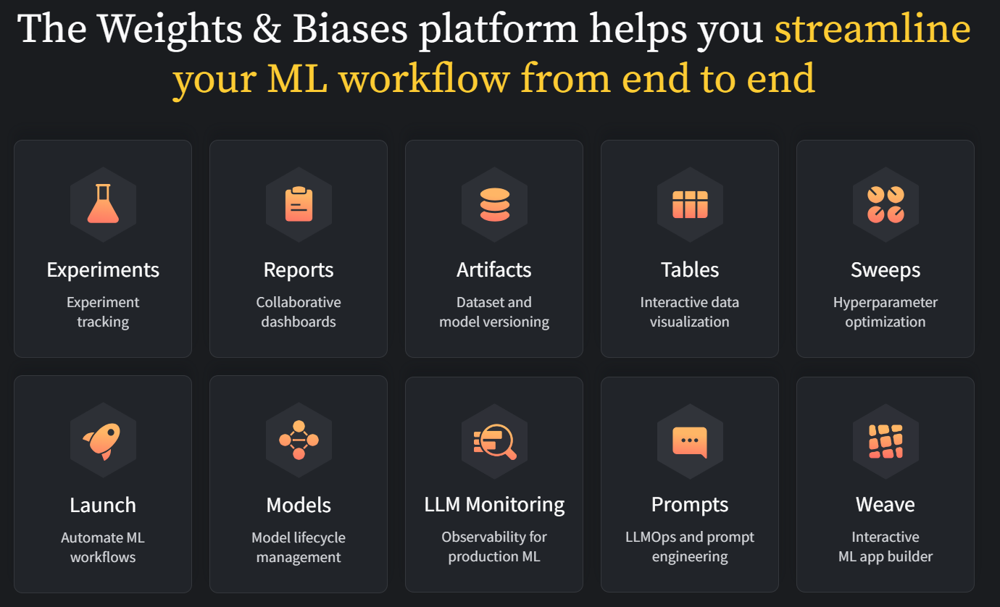

# 🎨 ML-Art

## Motivation

This project represents an application of machine learning(ML) in the domain of visual arts, where we are hoping to see how technology can be used to interpret and analyze artistic works. By training a model to recognize different art styles, we can help automate the process of sorting and labeling artworks, which traditionally has been a manual task. Moreover, this technology can potentially uncover patterns and influences between art styles that may not be immediately apparent to human observers, contributing to research in art history.

Furthermore, this classifier can serve as a foundation for recommendation systems in digital art platforms, providing users with suggestions of art styles they might enjoy based on their preferences.

Lastly, the cross-pollination of art and ML can lead to creative new forms of expression and digital art especially from Generative Artificial Intelligence(AI), where they are pushing the boundaries of both technology and artistic creation. This project is a step of where AI not only recognizing human creativity, but also augments and expands it.

## Data Analysis

Aiming at building a classifier that can accurately predict the art style of a given piece, we chose the [WikiArt Art Movement/Styles datatset](https://www.kaggle.com/datasets/sivarazadi/wikiart-art-movementsstyles/data), which contains 13 different styles with more then 42.5 thousands of images in 29.23 GB. The following plot shows the distribution of each style in the dataset, it is crucial for understanding the dataset's bias towards certain styles, here Romanticism is the most dominant and Western Medieval the least. Hence we would balanced the data for training our classifier to ensure that it performs well across all art styles, not just the most frequently occurring ones.


Here we have also plotted a randomly selected image from each style, that hopefully can provide a better insight of each style and also make sure that our data is not flawed and contain instances from all styles.


## Getting Started


1. Create your env
```
make create_environment
```

2. Activate env
```
conda activate ml_art
```

3. Install dependencies
```
make requirements
```
4. Configuration

Setup your desired experiment
* First, start with data; configure styles and img_per_style
* Second, choose a model. We have a custom CNN and models from [timm models](https://timm.fast.ai/) such as resnet and efficientnet


5. Process raw data into .pt files

+ This assumes you have the raw data from [dataset src](https://www.kaggle.com/datasets/sivarazadi/wikiart-art-movementsstyles) such that:
    + data/raw/Academic_Art/Academic_Art/*.jpg
    + data/raw/Art_Nouveau/Art_Nouveau/*.jpg
    + data/raw/Baroque/Baroque/*.jpg
    + etc

```
make data
```
+ You should see something like this
```
[2024-01-10 21:50:10,436][__main__][INFO] - Processed raw data into a .pt file stored in C:\Users\Hasan\OneDrive\Desktop\Projects\ML-Ops\outputs\2024-01-10\21-50-10
```
6. Train the model

+ In your env, from project root

```
python ml_art/train_model.py
```

+ You should see something like this
```
[2024-01-10 22:35:15,741][__main__][INFO] - Saved Weights to C:\Users\Hasan\OneDrive\Desktop\Projects\ML-Ops\outputs\2024-01-10\22-34-09
[2024-01-10 22:35:15,799][__main__][INFO] - Saved training loss & accuracy to C:\Users\Hasan\OneDrive\Desktop\Projects\ML-Ops\outputs\2024-01-10\22-34-09
```

7. To Viz Training & Testing Loss/Acurracy

```
python ml_art/train_test_viz.py
```

+ You should see

```
[2024-01-10 22:43:32,781][__main__][INFO] - Saved Weights to C:\Users\Hasan\OneDrive\Desktop\Projects\ML-Ops\outputs\2024-01-10\22-39-15
[2024-01-10 22:43:32,821][__main__][INFO] - Saved loss & accuracy to C:\Users\Hasan\OneDrive\Desktop\Projects\ML-Ops\outputs\2024-01-10\22-39-15
[2024-01-10 22:44:15,657][__main__][INFO] - Saved loss & accuracy plots to C:\Users\Hasan\OneDrive\Desktop\Projects\ML-Ops\outputs\2024-01-10\22-39-15
```


## Docker

1. Build Docker

```
docker build -f dockerfiles\train_model.dockerfile . -t <image_name>:<tag>
```
2. Mount Volume & Run Interactively

We mount src files to edit files in container, data for dataloader to access input, outputs to access results (weights, plots, etc..)

```
docker run -it -v %cd%\ml_art\:/ml_art/ -v  %cd%\data\:/data/ -v %cd%\outputs\:/outputs/ <image_name>:<tag>
```

**OR Create A Bash Script**

3. run.sh:

+ CPU:
```
docker run -it -v "${PWD}/ml_art:/ml_art/" -v "${PWD}/data:/data/" -v "${PWD}/outputs:/outputs/" <container_name>:<tag>
```
+ GPU:
```
docker run --gpus all -it -v "${PWD}/ml_art:/ml_art/" -v "${PWD}/data:/data/" -v "${PWD}/outputs:/outputs/"  <container_name>:<tag>
```
+ Then run (on Windows requires bash via WSL):

```
bash dockerfiles/run.sh
```
## Weights & Biases




## Known Issues -> To Fix

1. Lambda related error in transforms.compose

In ml_art/data/make_dataset.py :

``` Python
transform = transforms.Compose(
        [
            transforms.Lambda(lambda img: pad_and_resize(img)),
            transforms.ToTensor()
        ]
    )
```
raises:
```
    Traceback (most recent call last):
  File "c:\Users\Hasan\OneDrive\Desktop\Projects\ML-Ops\ml_art\data\make_dataset.py", line 157, in main
    torch.save(train_dataset,os.path.join(data_cfg.processed_path,"train_set.pt"))
  File "C:\Users\Hasan\miniconda3\envs\ML-Art\Lib\site-packages\torch\serialization.py", line 619, in save
    _save(obj, opened_zipfile, pickle_module, pickle_protocol, _disable_byteorder_record)
  File "C:\Users\Hasan\miniconda3\envs\ML-Art\Lib\site-packages\torch\serialization.py", line 831, in _save
    pickler.dump(obj)
AttributeError: Can't pickle local object 'main.<locals>.<lambda>'
```
Temporary Fix:

``` Python
transform = transforms.Compose(
            [
                transforms.Resize((resize_target)),
                transforms.ToTensor()
            ]
        )
```

2. Loading .pt file requires import

In make_dataset.py :

``` Python
    # Create subset for training and test from the indices
    train_dataset = Subset(dataset, train_idx)
    test_dataset = Subset(dataset, test_idx)

    hydra_log_dir = hydra.core.hydra_config.HydraConfig.get().runtime.output_dir


    torch.save(train_dataset,os.path.join(hydra_log_dir,"train_set.pt"))
    torch.save(test_dataset,os.path.join(hydra_log_dir,"test_set.pt"))

    logger.info(f"Processed raw data into a .pt file stored in {hydra_log_dir}")
```

The dataloader is defined as:

```Python
def wiki_art(cfg: omegaconf.dictconfig.DictConfig):
    """Return train and test dataloaders for WikiArt."""

    train_loader = DataLoader(
        dataset=torch.load(os.path.join(cfg.dataset.processed_path,"train_set.pt")),
        batch_size=cfg.dataset.batch_size,
        shuffle=cfg.dataset.dataloader_shuffle)


    test_loader = DataLoader(
       dataset=torch.load(os.path.join(cfg.dataset.processed_path,"test_set.pt")),
        batch_size=cfg.dataset.batch_size,
        shuffle=cfg.dataset.dataloader_shuffle)

    return train_loader,test_loader
```
When loading is executed in any of the main scripts (train_model.py,etc..) it raises:

```
Traceback (most recent call last):
  File "c:\Users\Hasan\OneDrive\Desktop\Projects\ML-Ops\ml_art\train_model.py", line 134, in main
    train_loader,_ = wiki_art(config)
                     ^^^^^^^^^^^^^^^^
  File "C:\Users\Hasan\OneDrive\Desktop\Projects\ML-Ops\ml_art\data\data.py", line 12, in wiki_art
    dataset=torch.load(os.path.join(cfg.dataset.processed_path,"train_set.pt")),
            ^^^^^^^^^^^^^^^^^^^^^^^^^^^^^^^^^^^^^^^^^^^^^^^^^^^^^^^^^^^^^^^^^^^
  File "C:\Users\Hasan\miniconda3\envs\ml_art\Lib\site-packages\torch\serialization.py", line 1014, in load
    return _load(opened_zipfile,
           ^^^^^^^^^^^^^^^^^^^^^
  File "C:\Users\Hasan\miniconda3\envs\ml_art\Lib\site-packages\torch\serialization.py", line 1422, in _load
    result = unpickler.load()
             ^^^^^^^^^^^^^^^^
  File "C:\Users\Hasan\miniconda3\envs\ml_art\Lib\site-packages\torch\serialization.py", line 1415, in find_class
    return super().find_class(mod_name, name)
           ^^^^^^^^^^^^^^^^^^^^^^^^^^^^^^^^^^
AttributeError: Can't get attribute 'WikiArt' on <module '__main__' from 'c:\\Users\\Hasan\\OneDrive\\Desktop\\Projects\\ML-Ops\\ml_art\\train_model.py'>

```

Unless I import the modules below,even if they are unused

```Python
from ml_art.data.make_dataset import WikiArt,pad_and_resize
```

Since having unused imports is not good practice, hopefully you have any ideas on how to get rid od this!


## Project structure

The directory structure of the project looks like this:

```txt

├── Makefile             <- Makefile with convenience commands like `make data` or `make train`
├── README.md            <- The top-level README for developers using this project.
├── data
│   ├── processed        <- The final, canonical data sets for modeling.
│   └── raw              <- The original, immutable data dump.
│
├── docs                 <- Documentation folder
│   │
│   ├── index.md         <- Homepage for your documentation
│   │
│   ├── mkdocs.yml       <- Configuration file for mkdocs
│   │
│   └── source/          <- Source directory for documentation files
│
├── models               <- Trained and serialized models, model predictions, or model summaries
│
├── notebooks            <- Jupyter notebooks.
│
├── pyproject.toml       <- Project configuration file
│
├── reports              <- Generated analysis as HTML, PDF, LaTeX, etc.
│   └── figures          <- Generated graphics and figures to be used in reporting
│
├── requirements.txt     <- The requirements file for reproducing the analysis environment
|
├── requirements_dev.txt <- The requirements file for reproducing the analysis environment
│
├── tests                <- Test files
│
├── ML-Art  <- Source code for use in this project.
│   │
│   ├── __init__.py      <- Makes folder a Python module
│   │
│   ├── data             <- Scripts to download or generate data
│   │   ├── __init__.py
│   │   └── make_dataset.py
│   │
│   ├── models           <- model implementations, training script and prediction script
│   │   ├── __init__.py
│   │   ├── model.py
│   │
│   ├── visualization    <- Scripts to create exploratory and results oriented visualizations
│   │   ├── __init__.py
│   │   └── visualize.py
│   ├── train_model.py   <- script for training the model
│   └── predict_model.py <- script for predicting from a model
│
└── LICENSE              <- Open-source license if one is chosen
```

Created using [mlops_template](https://github.com/SkafteNicki/mlops_template), a [cookiecutter template](https://github.com/cookiecutter/cookiecutter) for getting started the course [Machine Learning Operations (MLOps) (02476)](https://kurser.dtu.dk/course/02476) offered by the [Technical University of Denmark](dtu.dk) in Jan 2024.
