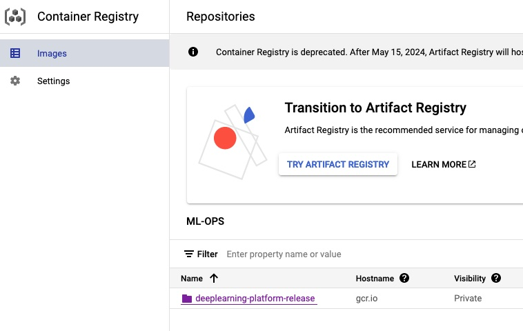

# Exam template for 02476 Machine Learning Operations

This is the report template for the exam. Please only remove the text formatted as with three dashes in front and behind
like:

```--- question 1 fill here ---```

where you instead should add your answers. Any other changes may have unwanted consequences when your report is auto
generated in the end of the course. For questions where you are asked to include images, start by adding the image to
the `figures` subfolder (please only use `.png`, `.jpg` or `.jpeg`) and then add the following code in your answer:

```markdown

```

In addition to this markdown file, we also provide the `report.py` script that provides two utility functions:

Running:

```bash
python report.py html
```

will generate an `.html` page of your report. After deadline for answering this template, we will autoscrape
everything in this `reports` folder and then use this utility to generate an `.html` page that will be your serve
as your final handin.

Running

```bash
python report.py check
```

will check your answers in this template against the constrains listed for each question e.g. is your answer too
short, too long, have you included an image when asked to.

For both functions to work it is important that you do not rename anything. The script have two dependencies that can
be installed with `pip install click markdown`.

## Overall project checklist

The checklist is *exhaustic* which means that it includes everything that you could possible do on the project in
relation the curricilum in this course. Therefore, we do not expect at all that you have checked of all boxes at the
end of the project.

### Week 1

* [ ] Create a git repository
* [ ] Make sure that all team members have write access to the github repository
* [ ] Create a dedicated environment for you project to keep track of your packages
* [ ] Create the initial file structure using cookiecutter
* [ ] Fill out the `make_dataset.py` file such that it downloads whatever data you need and
* [ ] Add a model file and a training script and get that running
* [ ] Remember to fill out the `requirements.txt` file with whatever dependencies that you are using
* [ ] Remember to comply with good coding practices (`pep8`) while doing the project
* [ ] Do a bit of code typing and remember to document essential parts of your code
* [ ] Setup version control for your data or part of your data
* [ ] Construct one or multiple docker files for your code
* [ ] Build the docker files locally and make sure they work as intended
* [ ] Write one or multiple configurations files for your experiments
* [ ] Used Hydra to load the configurations and manage your hyperparameters
* [ ] When you have something that works somewhat, remember at some point to to some profiling and see if
  	you can optimize your code
* [ ] Use Weights & Biases to log training progress and other important metrics/artifacts in your code. Additionally,
  	consider running a hyperparameter optimization sweep.
* [ ] Use Pytorch-lightning (if applicable) to reduce the amount of boilerplate in your code

### Week 2

* [ ] Write unit tests related to the data part of your code
* [ ] Write unit tests related to model construction and or model training
* [ ] Calculate the coverage.
* [ ] Get some continuous integration running on the github repository
* [ ] Create a data storage in GCP Bucket for you data and preferable link this with your data version control setup
* [ ] Create a trigger workflow for automatically building your docker images
* [ ] Get your model training in GCP using either the Engine or Vertex AI
* [ ] Create a FastAPI application that can do inference using your model
* [ ] If applicable, consider deploying the model locally using torchserve
* [ ] Deploy your model in GCP using either Functions or Run as the backend

### Week 3

* [ ] Check how robust your model is towards data drifting
* [ ] Setup monitoring for the system telemetry of your deployed model
* [ ] Setup monitoring for the performance of your deployed model
* [ ] If applicable, play around with distributed data loading
* [ ] If applicable, play around with distributed model training
* [ ] Play around with quantization, compilation and pruning for you trained models to increase inference speed

### Additional

* [ ] Revisit your initial project description. Did the project turn out as you wanted?
* [ ] Make sure all group members have a understanding about all parts of the project
* [ ] Uploaded all your code to github

## Group information

### Question 1
> **Enter the group number you signed up on <learn.inside.dtu.dk>**
>
> Answer:

> Group 98 

### Question 2
> **Enter the study number for each member in the group**
>
> Example:
>
> *sXXXXXX, sXXXXXX, sXXXXXX*
>
> Answer:

> s203211, s216410, s233478 

### Question 3
> **What framework did you choose to work with and did it help you complete the project?**
>
> Answer length: 100-200 words.
>
> Example:
> *We used the third-party framework ... in our project. We used functionality ... and functionality ... from the*
> *package to do ... and ... in our project*.
>
> Answer:

> In this project, we utilized the [TIMM](https://timm.fast.ai/) framework, a deep-learning library offering a variety of pre-trained image processing models. Initially, we developed a custom deep-learning model comprising three convolutional layers, pooling, and fully connected layers. This model served as our baseline for evaluating suitable models. Digging into TIMM's model repository, we trained several models, assessing their performance against our baseline. The framework's flexibility in model selection and ease of integration greatly facilitated the comparative analysis and significantly contributed to the project's execution, enabling efficient experimentation. 

## Coding environment

> In the following section we are interested in learning more about you local development environment.

### Question 4

> **Explain how you managed dependencies in your project? Explain the process a new team member would have to go**
> **through to get an exact copy of your environment.**
>
> Answer length: 100-200 words
>
> Example:
> *We used ... for managing our dependencies. The list of dependencies was auto-generated using ... . To get a*
> *complete copy of our development environment, one would have to run the following commands*
>
> Answer:

>For managing dependencies in our project, we employed a combination of Makefile scripts and conda, an open-source package management and environment management system. This approach allowed us to automate the environment setup and ensure all dependencies are correctly installed, fostering a consistent development environment for all team members.

>To set up an identical environment, new team members are required to perform a few simple steps. After obtaining the project's source code, they should run make `create_environment` in the terminal, which triggers the setup of a new conda environment with the necessary Python version and dependencies. Once the environment is created, they would activate it using `conda activate ml_art`. Subsequently, to install all required dependencies, they execute make requirements, which installs the exact versions of the packages specified in the project's `requirements.txt`. Finally, any additional configuration steps, if necessary, are performed as per the project documentation. This process ensures that the team member's environment mirrors the project's intended setup precisely. 

### Question 5

> **We expect that you initialized your project using the cookiecutter template. Explain the overall structure of your**
> **code. Did you fill out every folder or only a subset?**
>
> Answer length: 100-200 words
>
> Example:
> *From the cookiecutter template we have filled out the ... , ... and ... folder. We have removed the ... folder*
> *because we did not use any ... in our project. We have added an ... folder that contains ... for running our*

> Answer:

>In our project, which was initialized using the [mlops_template](https://github.com/SkafteNicki/mlops_template) we tailored the repository structure to align with our project's workflow, that streamlines machine learning operations. The `data` directory is partitioned into `processed` for ready-to-use datasets (saved as .pt files) and `raw` for original datasets, ensuring data integrity and facilitating reproducibility. The `src/models` folder contains models, predictions, and summaries, while `notebooks` serve for interactive analysis and prototyping.

>The `reports` directory includes this generated analyses and figures. The `requirements.txt` and `requirements_dev.txt` files list the necessary libraries for running and developing the project, respectively.

>Unit testing is handled within the `tests` directory, ensuring robustness and reliability for our code. The `ml_art` directory is the core module, structured to hold data script, model code, and visualization scripts. Additionally, `train_model.py` and `predict_model.py` scripts are included at the root of the module for straightforward model training and prediction.

>The `Makefile` provides convenience commands for us when deploying the model. `pyproject.toml` configures project settings, and the `LICENSE` file specifies the terms of use. This structure helps us to navigate the project with ease, promoting a good workflow from development to deployment. 

>The `dockerfiles` provides the scripts for building the docker images for training as well as a bash script for running the container and mounting the necessary volumes.


### Question 6

> **Did you implement any rules for code quality and format? Additionally, explain with your own words why these**
> **concepts matters in larger projects.**
>
> Answer length: 50-100 words.
>
> Answer: 

> In our project, we enforced code quality and format rules using pre-commit hooks with `Black` for consistent code formatting and `Flake8` for ensuring adherence to coding standards. These tools automate the process of maintaining a clean codebase, which is crucial in larger projects to ensure readability, reduce complexity, and facilitate collaboration among team members by standardizing the code style and catching errors early in the development cycle. 

## Version control

> In the following section we are interested in how version control was used in your project during development to
> corporate and increase the quality of your code.

### Question 7

> **How many tests did you implement and what are they testing in your code?**
>
> Answer length: 50-100 words.
>
> Example:
> *In total we have implemented X tests. Primarily we are testing ... and ... as these the most critical parts of our*
> *application but also ... .*
>
> Answer:

>Throughout our development process, we implemented a comprehensive suite of 6 unit tests focused on the core functionalities of our application. These tests cover data processing routines, model training/predicting stability and the integration of our machine learning pipeline components such as `omegaconf` and `logging`. By testing three critical .py scripts: `make_dataset`, `predict_model` and `train_model`, we ensure that data is correctly handled, models perform as expected, and the end-to-end workflow is robust against any future changes and additions to the code. 

### Question 8

> **What is the total code coverage (in percentage) of your code? If you code had an code coverage of 100% (or close**
> **to), would you still trust it to be error free? Explain you reasoning.**
>
> Answer length: 100-200 words.
>
> Example:
> *The total code coverage of code is X%, which includes all our source code. We are far from 100% coverage of our **
> *code and even if we were then...*
>
> Answer:

>The current code coverage for our project stands at 60%, where all essential components, as aforementioned in question 7, only the visualization of the model performance is barely covered. Ideally, all integral components, including data handling, model creation, and training functions should be thoroughly tested. However, achieving 100% coverage does not guarantee an error-free codebase. While high coverage can significantly reduce the likelihood of undetected bugs by ensuring that more code paths are tested, it cannot account for every possible real-world scenario or data anomaly. Code coverage is a valuable metric for identifying untested parts of the code, but it should be complemented with other quality assurance practices such as integration testing, manual code review and such to enhance the code's reliability and robustness. 

### Question 9

> **Did you workflow include using branches and pull requests? If yes, explain how. If not, explain how branches and**
> **pull request can help improve version control.**
>
> Answer length: 100-200 words.
>
> Example:
> *We made use of both branches and PRs in our project. In our group, each member had an branch that they worked on in*
> *addition to the main branch. To merge code we ...*
>
> Answer:

> Our workflow indeed incorporated the use of branches and pull requests, which are fundamental practices in collaborative version control. Each new feature or bug fixing,was developed on a separate branch, ensuring that the master branch remained stable. For instance, the `feature/unit_tests` branch, was used to work on unit tests specifically. Once the work on a branch was completed and tested, a pull request (PR) was opened. This triggered a code review process, allowing team members to discuss changes and request modifications before merging into the main codebase. PRs also kicked off automated tests which include `GitGuardian Security Checks` and `Deployment Test` which runs  the code formation test as previously mentioned and the unit tests, to ensure new changes didn't break existing functionality and maintain the coding consistency. By using this approach, we maintained a commit history with good manner and ensured that only reviewed and tested code was integrated, thereby improving the overall code quality and project maintainability. 

### Question 10

> **Did you use DVC for managing data in your project? If yes, then how did it improve your project to have version**
> **control of your data. If no, explain a case where it would be beneficial to have version control of your data.**
>
> Answer length: 100-200 words.
>
> Example:
> *We did make use of DVC in the following way: ... . In the end it helped us in ... for controlling ... part of our*
> *pipeline*
>
> Answer:

> We did not use Data Version Control (DVC) in our project. Since we only had 1 version of the dataset, working with the data locally was convenient.  However, DVC can be incredibly beneficial in scenarios where data evolves over time, especially in projects where datasets are frequently updated with new information. For instance, if we were dealing with a continually improving dataset, where new samples were added periodically to enhance the model, DVC would allow us to track these changes efficiently. It would provide a systematic approach to record different dataset versions, making it easier to reproduce experiments, roll back to previous data states, and collaborate with team members by linking data changes to specific code updates. This ensures transparency and traceability in the development process, as every model's performance can be traced back to the exact data version as it was trained on, thereby simplifying debugging and improving reproducibility. 
Another example where dvc would be useful is in github workflows, we can use dvc pull and run tests on the data. However we decided to avoid that! 

### Question 11

> **Discuss you continues integration setup. What kind of CI are you running (unittesting, linting, etc.)? Do you test**
> **multiple operating systems, python version etc. Do you make use of caching? Feel free to insert a link to one of**
> **your github actions workflow.**
>
> Answer length: 200-300 words.
>
> Example:
> *We have organized our CI into 3 separate files: one for doing ..., one for running ... testing and one for running*
> *... . In particular for our ..., we used ... .An example of a triggered workflow can be seen here: <weblink>*
>
> Answer:

>Our project's CI system is designed to ensure code quality, consistency, and compatibility across different environments. It is organized into distinct workflows, includes testings for formatting and linting and then runs our unit tests. 

>As we discussed in question 6, our CI incorporates code formatting and linting checks using tools `black` and `flake8`. This step ensures that all submitted code adheres to standardized formatting rules, leading to a more readable and maintainable codebase. Black automatically formats code in a uniform style, while `flake8` checks for potential errors and enforces coding standards.  

>Following the linting and formatting checks, the CI pipeline runs unit tests using `pytest` as we introduced in question 8. This is a crucial step as it automatically validates the correctness of the code against pre-defined test cases. Our unit testing covers various functionalities of the application, ensuring that new changes do not introduce regressions or break existing features. 

>Additionally, our CI setup is configured to test across multiple operating systems and Python versions. This cross-environment testing ensures that our application remains consistent and functional in various deployment scenarios, catering to a wider user base.

> An example of a triggered workflow, demonstrating these CI steps in action, can be viewed at the following link: [CI Workflow Example](https://github.com/ravvnen/ML-Ops/actions/runs/7582853754/job/20653285263). This shows the actual execution of our CI pipeline, reflecting the comprehensive checks and tests that every change in our project undergoes. 


## Running code and tracking experiments

> In the following section we are interested in learning more about the experimental setup for running your code and
> especially the reproducibility of your experiments.

### Question 12

> **How did you configure experiments? Did you make use of config files? Explain with coding examples of how you would**
> **run a experiment.**
>
> Answer length: 50-100 words.
>
> Example:
> *We used a simple argparser, that worked in the following way: python my_script.py --lr 1e-3 --batch_size 25*
>
> Answer:

>In our experiments, we used Hydra, allowing us to dynamically create and manage configurations for each run. It enabled us to define a structured configuration in YAML format, as seen in `config.yaml` under the config folder inside ml_art. To run an experiment with different hyperparameters or settings, we can used Hydra's command-line overrides, like so:

```bash
python train_model.py +model=efficientnet batch_size=64 lr=0.01
```

>Here, `model=efficientnet` specifies the model to use, and we override the batch size and learning rate directly from the command line without altering the `config.yaml` file. This method is powerful for running multiple experiments with varying configurations. OK

### Question 13

> **Reproducibility of experiments are important. Related to the last question, how did you secure that no information**
> **is lost when running experiments and that your experiments are reproducible?**
>
> Answer length: 100-200 words.
>
> Example:
> *We made use of config files. Whenever an experiment is run the following happens: ... . To reproduce an experiment*
> *one would have to do ...*
>
> Answer:

>Our approach to ensuring reproducibility hinged on controlled randomness and meticulous logging. By initializing all random number generators with a fixed seed, we guaranteed deterministic behavior in experiments. Configurations for each run were managed by Hydra, which, coupled with the `logging` package, ensured all settings were logged. The unique output directory generated by Hydra for each run contained the exact config file used, allowing for straightforward replication of experiments. For added robustness, we containerized our environment, thus preserving the experiment's context in its entirety. We built a docker image and pushed it to dockerhub, which allows to easily reproduce the tranining process on other machines, such as an BM instance.

### Question 14

> **Upload 1 to 3 screenshots that show the experiments that you have done in W&B (or another experiment tracking**
> **service of your choice). This may include loss graphs, logged images, hyperparameter sweeps etc. You can take**
> **inspiration from [this figure](figures/wandb.png). Explain what metrics you are tracking and why they are**
> **important.**
>
> Answer length: 200-300 words + 1 to 3 screenshots.
>
> Example:
> *As seen in the first image when have tracked ... and ... which both inform us about ... in our experiments.*
> *As seen in the second image we are also tracking ... and ...*
>
> Answer:

>For testing we use W&B to visualize the input image and predictions, while the test set accuracy is saved in logs.

<div style="text-align:center;">
    
</div>

>For training we use W&B to visualize the plots for accuracy and loss as a function of the epochs.

<div style="text-align:center;">
    
</div>

> Additionally we sync tensorboard with W&B and use the system monitoring for profiling.

### Question 15

> **Docker is an important tool for creating containerized applications. Explain how you used docker in your**
> **experiments? Include how you would run your docker images and include a link to one of your docker files.**
>
> Answer length: 100-200 words.
>
> Example:
> *For our project we developed several images: one for training, inference and deployment. For example to run the*
> *training docker image: `docker run trainer:latest lr=1e-3 batch_size=64`. Link to docker file: <weblink>*
>
> Answer:

> In our project, docker is used to run training on the compute engine instance. We run docker pull to get our image, then we use docker run with an entrypoint to the training script. Containerizing the training process allows us to quickly deploy to the compute engine instance and utilize the GPUs in the cloud and greatly cut down the training time.


### Question 16

> **When running into bugs while trying to run your experiments, how did you perform debugging? Additionally, did you**
> **try to profile your code or do you think it is already perfect?**
>
> Answer length: 100-200 words.
>
> Example:
> *Debugging method was dependent on group member. Some just used ... and others used ... . We did a single profiling*
> *run of our main code at some point that showed ...*
>
> Answer:

>When debugging, we used a multi-faceted strategy, combining the traditional print statements always easy to trace execution, `pdb` debugger for interactive inspection. Additionally, use of assertions and logging facilitated early detection of anomalies.

## Working in the cloud

> In the following section we would like to know more about your experience when developing in the cloud.

### Question 17

> **List all the GCP services that you made use of in your project and shortly explain what each service does?**
>
> Answer length: 50-200 words.
>
> Example:
> *We used the following two services: Engine and Bucket. Engine is used for... and Bucket is used for...*
>
> Answer: 

> The GCP services we used were: Bucket (Cloud Storage), and the Vertex AI. These two services were used in conjunction with each other. 
The bucket, from Cloud Storage, was used for storing all the data used for training our model, utilizing Vertex AI. The data consisted of art-images from 5 different art genres: Academic Art, Art_Nouvea, Baroque, Expressionism, Japanese Art, and Western Medieval. With Vertex AI, two different models were trained, ml-art-5-categories, which was trained on all the images from each art genre, and ml-1000, which was trained on specifically only 1000 images of each art genre. 

### Question 18

> **The backbone of GCP is the Compute engine. Explained how you made use of this service and what type of VMs**
> **you used?**
>
> Answer length: 100-200 words.
>
> Example:
> *We used the compute engine to run our ... . We used instances with the following hardware: ... and we started the*
> *using a custom container: ...*
>
> Answer: 

> We merely explored the compute engine for the sake of learning, however nothing was integrated into our project. We tried to create a VM instance based on the docker image we built. However, that didnt workout. What we tried was to create a VM instance with an accelerator, the used docker pull to get our image and then run it! The image included an entrypoint to the training script.

### Question 19

> **Insert 1-2 images of your GCP bucket, such that we can see what data you have stored in it.**
> **You can take inspiration from [this figure](figures/bucket.png).**
>
> Answer: 

<div style="text-align:center;">
    
</div>
<div style="text-align:center;">
    
</div>

### Question 20

> **Upload one image of your GCP container registry, such that we can see the different images that you have stored.**
> **You can take inspiration from [this figure](figures/registry.png).**
>
> Answer:

<div style="text-align:center;">
    
</div>
<div style="text-align:center;">
    
</div>

### Question 21

> **Upload one image of your GCP cloud build history, so we can see the history of the images that have been build in**
> **your project. You can take inspiration from [this figure](figures/build.png).**
>
> Answer:
<div style="text-align:center;">
    
</div>

### Question 22

> **Did you manage to deploy your model, either in locally or cloud? If not, describe why. If yes, describe how and**
> **preferably how you invoke your deployed service?**
>
> Answer length: 100-200 words.
>
> Example:
> *For deployment we wrapped our model into application using ... . We first tried locally serving the model, which*
> *worked. Afterwards we deployed it in the cloud, using ... . To invoke the service an user would call*
> *`curl -X POST -F "file=@file.json"<weburl>`*
>
> Answer:

> Locally, the model was deployed with torchserve, only a minimal experiment for the sake of exploration was setup.
>In terms of deploying it in the cloud, this was done through the utilization of Vertex AI. Once we had initialized and trained our model, it was possible for us to deploy it to an endpoint. This allowed end-users, through the UI, to click `upload image`, and ask the model for a prediction of which genre it would categorize the given image. It was also possible to send access the API with a curl request:

```
curl \
-X POST \
-H "Authorization: Bearer $(gcloud auth print-access-token)" \
-H "Content-Type: application/json" \
https://us-central1-aiplatform.googleapis.com/v1/projects/${PROJECT_ID}/locations/us-central1/endpoints/${ENDPOINT_ID}:predict \
-d "@${INPUT_DATA_FILE}"
```

<div style="text-align:center;">
    
</div>

### Question 23

> **Did you manage to implement monitoring of your deployed model? If yes, explain how it works. If not, explain how**
> **monitoring would help the longevity of your application.**
>
> Answer length: 100-200 words.
>
> Example:
> *We did not manage to implement monitoring. We would like to have monitoring implemented such that over time we could*
> *measure ... and ... that would inform us about this ... behaviour of our application.*
>
> Answer:

> While we did not directly implement monitoring for our deployed model, the use of Google Cloud's Vertex AI provided us with some essential monitoring capabilities. This setup automatically tracked key performance indicators such as Traffic, Errors, and Median Latency, which offered valuable insights into the model's operational aspects.

> In an ideal scenario, comprehensive monitoring would involve tracking various metrics such as request rates, error rates, response times, and resource utilization. It would also include the monitoring of model accuracy and drift over time to identify when a model might need retraining due to changes in the underlying data patterns. This approach would significantly enhance the model's reliability and robustness, ensuring that it continually meets the needs and expectations of its users. Additionally, it could help in optimizing resource usage thus reducing costs.

### Question 24

> **How many credits did you end up using during the project and what service was most expensive?**
>
> Answer length: 25-100 words.
>
> Example:
> *Group member 1 used ..., Group member 2 used ..., in total ... credits was spend during development. The service*
> *costing the most was ... due to ...*
>
> Answer:

>Group member 1 spent all 50 credits, Group member 2 spent 50 credits, and Group member 3 spent 0 credits, so in total we spent 100 credits. The credits used by group member 1 were spent on building and deploying the ML model using Vertex AI . For group member 2, the credits were spent on building a Compute Engine instance for training, which utilized accelerators (GPU).

## Overall discussion of project

> In the following section we would like you to think about the general structure of your project.

### Question 25

> **Include a figure that describes the overall architecture of your system and what services that you make use of.**
> **You can take inspiration from [this figure](figures/overview.png). Additionally in your own words, explain the**
> **overall steps in figure.**
>
> Answer length: 200-400 words
>
> Example:
>
> *The starting point of the diagram is our local setup, where we integrated ... and ... and ... into our code.*
> *Whenever we commit code and puch to github, it auto triggers ... and ... . From there the diagram shows ...*
>
> Answer:

> In our project, the local and cloud environments were isolated, since we did not deploy our custom model to the cloud, but instead use google's AutoML, this resulted in 2 different architecture.

> The local setup:

<div style="text-align:center;">
    
</div>

> The cloud setup:

<div style="text-align:center;">
    
</div>

### Question 26

> **Discuss the overall struggles of the project. Where did you spend most time and what did you do to overcome these**
> **challenges?**
>
> Answer length: 200-400 words.
>
> Example:
> *The biggest challenges in the project was using ... tool to do ... . The reason for this was ...*
>
> Answer:

> Learning curve of working 3 members on a github repository, so we had our fair share of learning experiences with rebasing and merging, through pull requests. 

### Question 27

> **State the individual contributions of each team member. This is required information from DTU, because we need to**
> **make sure all members contributed actively to the project**
>
> Answer length: 50-200 words.
>
> Example:
> *Student sXXXXXX was in charge of developing of setting up the initial cookie cutter project and developing of the*
> *docker containers for training our applications.*
> *Student sXXXXXX was in charge of training our models in the cloud and deploying them afterwards.*
> *All members contributed to code by...*
>
> Answer:

> Member s216410 was in charge of the local models, including the initial setup for the self-defined CNN model and other models from TIMM framework. The unit tests were also conducted by her. 

> Member s203211 setup the interfaces for using the model, such as make_dataset, train, and test based on member s216410 work.  The interfaces integrated with hydra configuration tool for easy configurability and wandb for experiment tracking. 

> Member s233478 uploaded the dataset to the cloud, then trained and deployed a model using Google AutoML. In addition to to setting up the github repository workflows.  


